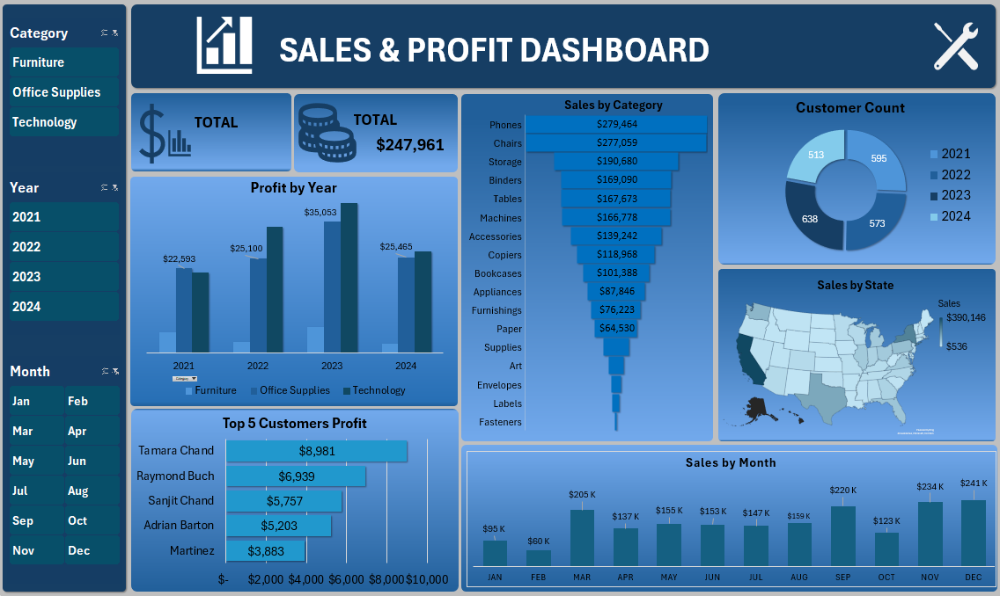

# Sales & Profit Dashboard

## 📊 Project Overview
This project is an interactive **Sales & Profit Dashboard** built using **Microsoft Excel**.
It provides insights into sales performance, profit trends, and category-wise analysis
using charts, slicers, and summary metrics.

## 🛠 Tool Used
- Microsoft Excel

## ✨ Key Features
- Year-wise and month-wise sales analysis
- Profit tracking by category and sub-category
- Interactive filters using slicers
- Clean and user-friendly dashboard layout

## 🖼 Dashboard Preview

## 📂 Project Structure

